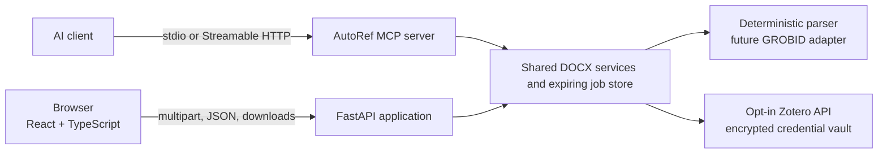
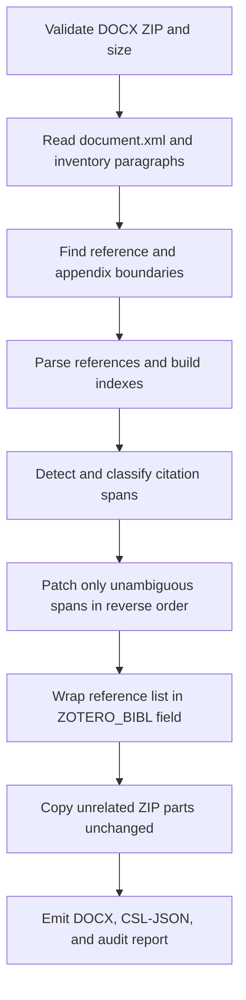
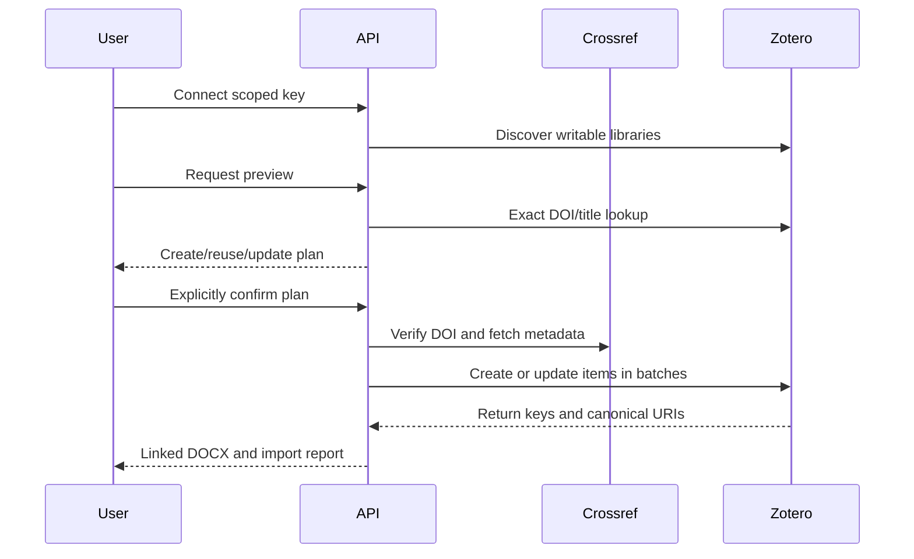

# Architecture

## Goals

AutoRef accepts a DOCX paper, discovers its bibliography and citation callouts, produces structured reference data, inserts native Zotero fields into safely matched callouts, and returns downloadable artifacts without reflowing or reconstructing the paper.

The design optimizes for fidelity, explainability, and conservative failure. A false negative stays visible as static text. A false positive silently corrupts scholarly attribution, so ambiguous candidates are not converted.

## System context



The frontend is built into the backend in the production-shaped deployment. The MCP server uses the same service layer rather than a second conversion implementation.

## Backend modules

- `main.py`: HTTP boundary, size checks, job lifecycle, and artifact delivery.
- `job_store.py`: opaque IDs, path confinement, 24-hour default retention, and cleanup.
- `docx_processor.py`: DOCX validation, paragraph inventory, reference boundaries, and complex Word-field insertion.
- `reference_parser.py`: deterministic low-dependency baseline that converts APA-like reference strings to CSL-shaped records.
- `citation_detector.py`: author-year and numeric recognition plus bibliography matching.
- `models.py`: internal evidence and output contracts.
- `credential_vault.py`: short-lived Fernet-encrypted API keys held in process memory.
- `zotero.py`: permission discovery, library selection, deduplication, item/collection writes, and rollback.
- `mcp_server.py`: MCP tools, resource, prompt, binary transport adapters, and explicit write confirmation.

## Conversion pipeline

The conversion pipeline is deliberately linear until an ambiguity is found; uncertain text remains unchanged.



1. Reject non-DOCX, oversized, malformed, or incomplete ZIP packages.
2. Read `word/document.xml` without loading macros, relationships, or external content.
3. Inventory paragraph text and locate a reference-list heading.
4. Stop the reference list at a later appendix/annex/declaration heading.
5. Parse each reference into an internal record with the original string retained.
6. Build author-year and ordinal indexes.
7. detect citation spans before the reference section and classify each as matched, ambiguous, or unmatched.
8. Patch only matched character spans, in reverse order inside each paragraph.
9. Wrap the detected reference-list body in one `ZOTERO_BIBL` field while retaining its original paragraphs as the cached visible result.
10. Copy every other DOCX ZIP part using its original `ZipInfo` metadata and payload.
11. Emit the converted DOCX, CSL-JSON library, and audit report.

## Phase 2 linked-import pipeline

```text
API key -> /keys/current -> writable personal/group libraries
                                  |
document references -> exact DOI/title lookup -> create/reuse/DOI-update preview
                                  |
                         explicit confirmation
                                  |
              Crossref DOI verification + metadata
                                  |
             optional collection + item batches (max 50)
                                  |
             returned keys/URIs -> linked Word fields + audit
```

The preview is saved in the expiring document job and bound to its library, collection, and digest. Import rejects changed options with `409`. Reused records are never modified, except an exact title match without a DOI can receive the source DOI through a version-guarded update. Before creating anything in Zotero, AutoRef verifies every DOI belonging to a planned new item and downloads the canonical Crossref work metadata. A failed verification aborts before collection or item creation. References without DOIs continue with locally parsed metadata. New records are then created in batches of at most 50. If Zotero reports a partial failure, AutoRef attempts version-guarded deletion of items it created and removes a newly created collection when possible; it never deletes reused items.



## Word field representation

Each citation uses a complex OOXML field:

```xml
<w:r><w:fldChar w:fldCharType="begin"/></w:r>
<w:r><w:instrText xml:space="preserve"> ADDIN ZOTERO_ITEM CSL_CITATION {...} </w:instrText></w:r>
<w:r><w:fldChar w:fldCharType="separate"/></w:r>
<w:r><w:t>(Author, 2024)</w:t></w:r>
<w:r><w:fldChar w:fldCharType="end"/></w:r>
```

The JSON stores the original visible citation in `properties`, each matched item in `citationItems`, embedded CSL `itemData`, and the CSL citation schema URL. The visible result is intentionally the exact source text. Zotero can later regenerate it when the user refreshes or edits the citation.

Narrative citations convert the complete author-and-year span into one field. The original
author wording is stored as the citation-item prefix with `suppress-author: true`, preserving
forms such as `Bragadin and Kähkönen (2016)` while keeping the whole visible citation inside
the Zotero field.

## Fidelity contract

“Same exact format” is implemented as a constrained invariant, not by re-creating the document with a high-level Word library:

- every ZIP part except `word/document.xml` is copied byte-for-byte;
- paragraph and run properties outside matched spans are unchanged;
- the cached field result equals the original citation text;
- the display run inherits the first matched run's properties;
- unresolved, ambiguous, nested, or structurally complex spans are skipped;
- visual regression compares source and output page renders.

OOXML serialization can change namespace declaration ordering inside `document.xml`, so the output is semantically and visually equivalent rather than byte-identical as a whole file.

## Known boundaries

- The baseline reference parser is strongest on APA-like references; MLA, Chicago notes, legal citations, and multilingual/no-space scripts need trained adapters and fixtures.
- Citations nested in hyperlinks, content controls, equations, text boxes, tracked changes, or existing fields are not blindly rewritten.
- Footnote/endnote citation conversion is a separate document-part traversal and is not enabled yet.
- The detected bibliography body becomes one dynamic `ZOTERO_BIBL` field. Its original paragraphs remain as the cached visible result; Zotero controls regenerated formatting when the user refreshes the document.
- CSL-JSON import does not relink word-processor citations; use confirmed API import for linkage.
- Phase 2 uses user-created scoped API keys. OAuth and durable multi-worker sessions remain roadmap work.
- Deduplication is deliberately exact and only proposes reuse; fuzzy matching and manual per-row overrides remain roadmap work.

## Security and privacy

- Files remain on the configured server and are not sent to third-party services by default. A confirmed Zotero workflow sends parsed reference metadata, not the DOCX, to Zotero.
- Jobs use server-generated opaque IDs and fixed artifact names resolved through allowlists.
- ZIP structure and required parts are validated before processing.
- Upload size defaults to 30 MB; jobs expire after 24 hours.
- API keys are transmitted only in headers, encrypted in memory, never persisted to job files, never returned, and expire after 30 minutes by default.
- External metadata enrichment must be explicit because DOIs, titles, and authors can disclose research interests.
- Production should add malware scanning, ZIP expansion limits, authentication, rate limits, encrypted storage, and a durable cleanup worker.

## Deployment shape

Phase one is intentionally a single deployable web application: Vite produces static assets that FastAPI serves alongside `/api`. The job store is local disk, suitable for one instance. Multi-instance deployment requires object storage, a shared job database, idempotent workers, and a queue.

See [the Mermaid and documentation conventions](DIAGRAMS.md) when extending this page.
