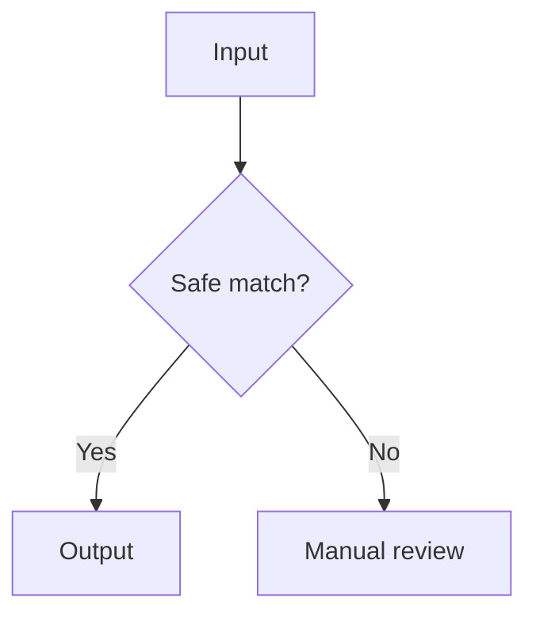

# Documentation and Mermaid conventions

AutoRef documentation uses Markdown first and Mermaid for diagrams that explain a workflow, boundary, or decision. Diagrams are source-controlled text: keep them close to the prose they explain, and make the surrounding text complete enough to stand alone when a renderer is unavailable.

## Authoring rules

- Use fenced `mermaid` blocks; do not embed generated images for diagrams.
- Give every diagram a short title in the preceding paragraph and a descriptive `accTitle` when supported by the renderer.
- Prefer `flowchart` for pipelines and boundaries, `sequenceDiagram` for request/response behavior, and `quadrantChart` or `timeline` only when they add meaning.
- Keep node labels short. Put security, retention, and failure details in prose below the chart.
- Use stable IDs and consistent direction (`TD` for pipelines, `LR` for system boundaries).
- Avoid styling that depends on a dark theme or a specific Mermaid version.
- Validate fences locally by opening the Markdown in GitHub or a Mermaid-compatible Markdown preview.
- Update a diagram in the same change as the behavior or decision it describes.

## Recommended pattern

The repository uses Mermaid diagrams for behavior, not decoration. Screenshots are reserved for user-facing states that are easier to understand visually than through text, and are captured from the running application under `docs/images/`.

## Visual assets

- [Upload screen](images/autoref-upload.png)
- [Analysis results screen](images/autoref-analysis.png)
