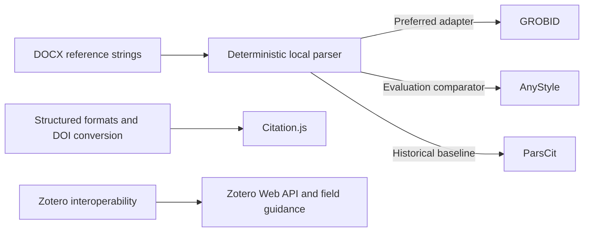

# Open-source system research

Research checked on 20 August 2026. Primary project sources and Zotero documentation are linked directly.

## Evaluated components

| System | Strength | Limitation for this application | Decision |
| --- | --- | --- | --- |
| [GROBID](https://github.com/grobidOrg/grobid) | Apache-2.0 service; mature reference-string parsing, reference extraction, and citation-context resolution; TEI output; optional Crossref consolidation | Java service with a larger runtime; document pipeline is PDF-centered, while AutoRef already has structured DOCX text and must preserve OOXML | Preferred production parser adapter after the deterministic baseline; send only isolated reference strings to `processCitationList` |
| [AnyStyle](https://github.com/inukshuk/anystyle) | BSD-style license; trainable CRF-based parser/finder; direct CSL-JSON, BibTeX, and RIS outputs; self-hostable | Ruby/Wapiti runtime; default training data is strongly English/Latin-script weighted and the project documents limits for no-space scripts | Excellent lighter alternative and evaluation comparator, especially when custom training is planned |
| [CERMINE](https://github.com/CeON/CERMINE) | Parses individual reference strings and full scholarly PDFs; Java library, CLI, and service | AGPL-3.0 creates distribution obligations; older release shape; PDF/JATS emphasis adds little for DOCX | Benchmark candidate, not the default embedded service |
| [ParsCit](https://github.com/knmnyn/ParsCit) | Foundational open CRF reference parser and citation-context extractor | Older Perl stack and models; less convenient integration and maintenance profile | Historical/evaluation baseline only |
| [Citation.js](https://github.com/citation-js/citation-js) | Modular CSL/BibTeX/RIS/DOI conversion and browser/Node formatting | Converts structured formats; it does not solve arbitrary raw-reference segmentation and DOCX field insertion | Useful later for client previews and format conversion, not the core parser |
| [Zotero Translation Server](https://github.com/zotero/translation-server) | Runs official Zotero translators without a desktop client; identifier lookup and import/export endpoints | Does not discover citations in DOCX or preserve Word fields; network translators require operational controls | Phase-two metadata enrichment and normalization service |

## Why GROBID is the preferred parser adapter

GROBID reports reference parsing and citation-context capabilities, exposes a service boundary, is actively maintained, and uses a permissive Apache-2.0 license. AutoRef should not give it the whole DOCX: Word already provides ordered paragraphs, while sending isolated bibliography strings avoids layout loss and reduces data exposure. The adapter should accept the same `ReferenceParser` contract as the built-in parser, map TEI `biblStruct` fields to CSL, and retain both the raw string and parser confidence/evidence.

The built-in parser remains valuable as a deterministic offline fallback, a way to boot the application without a multi-gigabyte model service, and a baseline for evaluation. It must not be presented as style-independent.

## Zotero interoperability findings

Zotero's [Word plugin documentation](https://www.zotero.org/support/word_processor_plugin_usage) recommends Word Fields for normal use. Zotero explains that field codes beginning with `ADDIN ZOTERO_ITEM CSL_CITATION` store hidden reference data behind formatted citation text in its [field-code article](https://www.zotero.org/support/kb/word_field_codes).

The field payload observed in Zotero-generated documents and documented behavior uses:

- a Word complex field (`begin`, instruction, `separate`, cached display, `end`);
- the `ADDIN ZOTERO_ITEM CSL_CITATION` instruction prefix;
- `citationID`, `properties`, and `citationItems`;
- one or more item identifiers/URIs plus embedded CSL `itemData`;
- the CSL citation JSON schema URL.

Zotero supports direct [CSL-JSON import](https://www.zotero.org/support/kb/importing_standardized_formats), making it the cleanest phase-one library artifact. However, Zotero's [field-mapping guidance](https://www.zotero.org/support/kb/field_mappings) explicitly warns that import/export loses links from existing word-processor documents. Therefore AutoRef cannot honestly promise that a separately imported file becomes the linked backing library for the generated fields.

## Phase-two solution to real linkage

1. Obtain authorization for a Zotero user or group library.
2. Parse and show a mandatory review screen before external writes.
3. Search by DOI/ISBN/PMID and normalized title to avoid duplicates.
4. Create or reuse items through the [Zotero Web API](https://www.zotero.org/support/dev/web_api/v3/basics).
5. Capture each returned library key and canonical item URI.
6. Generate fields with those real URIs and IDs, not AutoRef placeholders.
7. Optionally create a collection named for the uploaded document.
8. Record all remote writes and offer a compensating rollback for newly created items.

## Evaluation plan

Build a gold corpus stratified by citation family and document complexity:

- APA 7, Harvard, Vancouver/IEEE, MLA, Chicago author-date, Chicago notes;
- single/group authors, same-author/same-year suffixes, narrative citations, locators, citation clusters, numeric ranges;
- references split across runs, hyperlinks, footnotes/endnotes, tables, content controls, tracked changes, and existing Zotero fields;
- English, accented Latin, Arabic, CJK, and mixed-direction content.

Report reference segmentation F1, field-level metadata precision/recall, citation-span F1, citation-to-reference linkage accuracy, safe abstention rate, false-conversion rate, DOCX structural validity, Zotero refresh success, and page-render pixel differences. A release gate should prioritize zero false conversions over recall.

Use [the Mermaid conventions](DIAGRAMS.md) when adding evaluated systems, research decisions, or evidence links.

