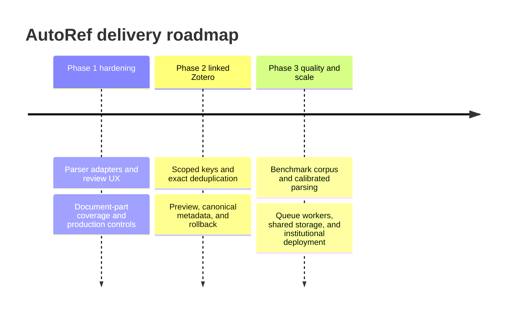

# Roadmap

## Phase 1 hardening

- add the GROBID `processCitationList` adapter and Docker profile
- review/edit screen for parsed references and ambiguous citation links
- traverse footnotes, endnotes, headers, text boxes, and comments explicitly
- preserve citations that span hyperlinks/content controls through targeted fixtures
- existing-Zotero-field detection and idempotent reprocessing
- Word/Zotero interoperability tests for dynamic bibliography refresh and style changes
- document-style classifier beyond author-date versus numeric
- multilingual heading catalog and bidirectional-text tests
- production ZIP bomb limits, malware scanning, rate limiting, auth, and object storage

## Phase 2: Zotero integration (implemented baseline)

- [x] scoped API-key connection flow with encrypted, expiring server-memory storage
- [x] personal and group library selection based on key write permissions
- [x] exact DOI/title deduplication with an explicit review step
- [x] create/reuse Zotero items and optional collections
- [x] use returned item keys and canonical URIs in generated fields
- [x] direct import audit, batched writes, and best-effort compensating rollback
- [x] zero-token persistence/response/logging policy
- [ ] OAuth 1.0a connection flow for hosted multi-user deployments
- [ ] editable per-reference create/reuse/skip overrides in the review screen
- [ ] durable encrypted credential/session store for multi-worker deployments

## Phase 3: quality and scale

- human-labeled multi-style benchmark and continuous regression corpus
- queue-based workers, shared job database, object storage, and resumable uploads
- GROBID/AnyStyle ensemble with calibrated confidence
- Crossref/OpenAlex/PubMed enrichment behind privacy controls
- institutional deployment with SSO, retention policy, and audit exports

Roadmap diagrams and Markdown should follow [the repository documentation conventions](DIAGRAMS.md).
