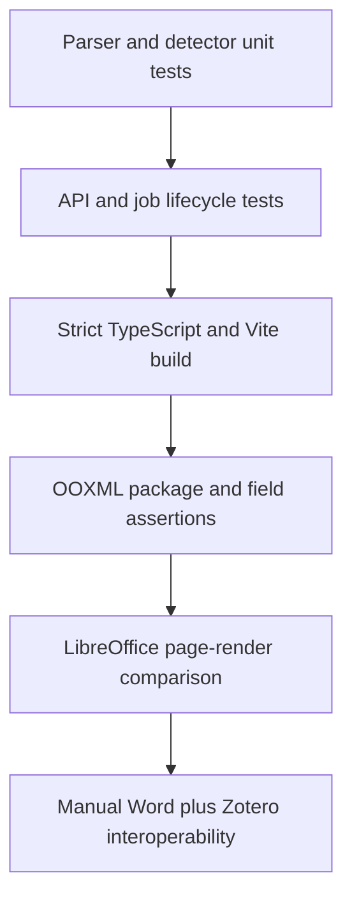

# Verification strategy

Testing follows the same risk boundary as the product: analyze locally, verify structural fidelity, and treat external Zotero writes as an explicitly reviewed integration.

## Automated layers

1. Unit tests validate APA parsing, stable IDs, narrative citations, parenthetical citations, and numeric ranges.
2. OOXML tests verify the Zotero instruction payload, cached visible text, and byte preservation of unrelated ZIP parts.
3. API tests should cover upload limits, corrupt archives, expired jobs, and artifact path confinement.
4. Frontend compilation runs TypeScript strict checks before Vite builds.
5. Mocked Zotero API tests validate exact DOI reuse, item payload creation, returned key/URI linkage, and should expand to cover permission discovery and rollback conflicts.

## DOCX fidelity gate

For each representative fixture:

1. Validate both source and result with `unzip -t` and an OOXML validator.
2. Hash every ZIP member other than intentionally changed parts.
3. Assert that normalized visible paragraph text is unchanged.
4. Count and parse every `CSL_CITATION` JSON instruction.
5. Render source and result with LibreOffice using isolated profiles.
6. Compare every page image; investigate any non-field visual difference.
7. Open in current Microsoft Word with Zotero installed, run Add/Edit Citation and Refresh, and record the result.

LibreOffice rendering checks layout, but it cannot prove Zotero plugin compatibility. A release therefore needs both render regression and manual/automated Word-plus-Zotero interoperability tests.

Use [the Mermaid conventions](DIAGRAMS.md) when adding a new verification workflow or release gate.
